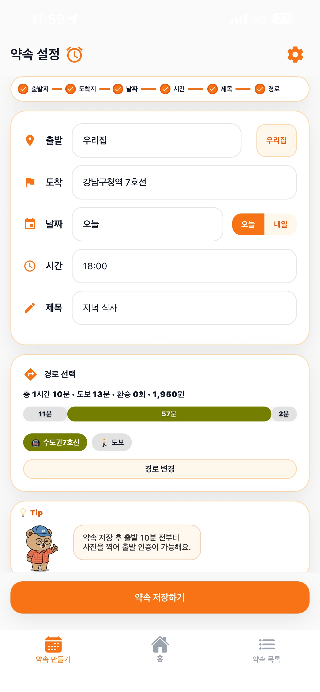
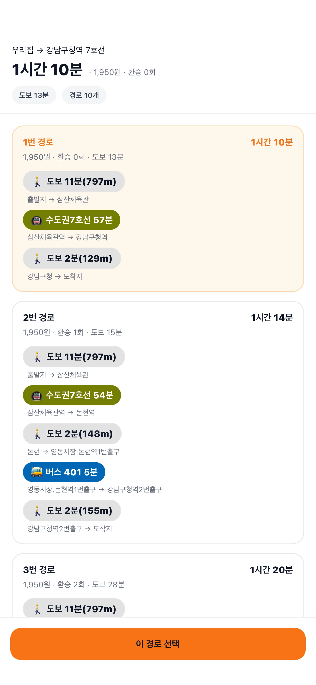
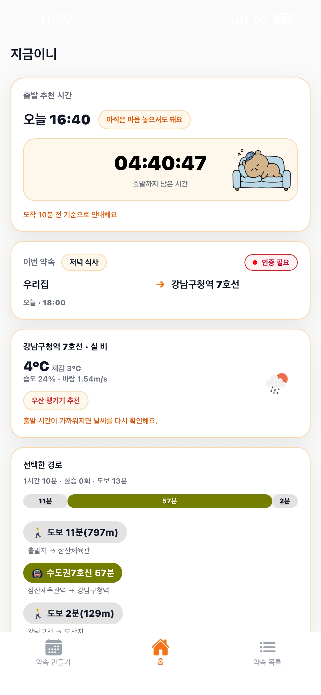
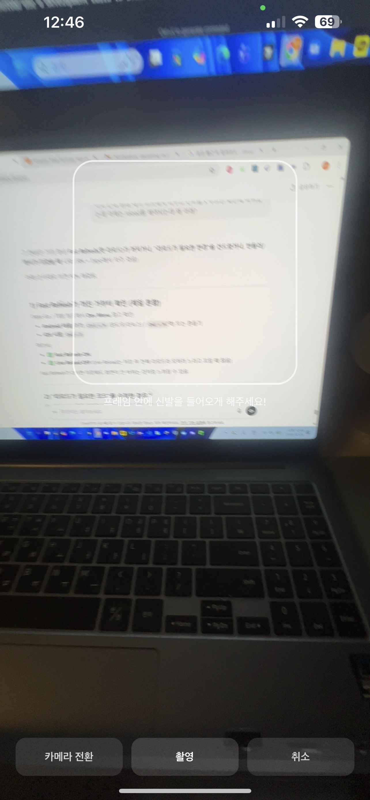

<p align="center">
  
</p>

<h1 align="center">지금이니</h1>

<p align="center">
  <strong>약속 시간에 맞춰 계산한 출발 시각을 실제 출발 행동까지 연결하는 모바일 앱</strong>
</p>

<p align="center">
  <a href="https://apps.apple.com/kr/app/id6759585246"></a>
  <a href="https://play.google.com/store/apps/details?id=com.imkara1.meetalarm"></a>
  <a href="https://github.com/shinhanseo/meet_alarm_backend"></a>
  <a href="https://velog.io/@imkara/series/%EC%A7%80%EA%B8%88%EC%9D%B4%EB%8B%88"></a>
</p>

<p align="center">
  
  
  
</p>

---

## Overview

`지금이니`는 단순 일정 기록이 아니라 **사용자가 제시간에 집을 나서도록 돕는 것**에 초점을 둡니다. 약속 생성 → 대중교통 경로 선택 → 출발 시각 계산 → 로컬 알림 → 신발 사진 인증을 하나의 행동 흐름으로 연결했습니다.

> **개인 프로젝트** · 기획, UI/UX 디자인, React Native 앱, Node.js 백엔드, iOS·Android 심사와 배포 전 과정을 직접 담당했습니다.

## Screens

<p align="center">
  
  
  
  
</p>

## ✨ 핵심 기능

### 1) 약속 생성/수정
- 출발지, 도착지, 날짜, 시간, 약속 제목을 입력해 약속을 생성할 수 있습니다.
- 약속 수정 시 기존 데이터를 draft로 불러와 다시 저장할 수 있습니다.

### 2) 경로 탐색 + 추천 출발 시각 계산
- 서버에서 대중교통 경로 후보를 받아 선택할 수 있습니다.
- 선택된 경로의 총 이동 시간 + 버퍼(기본 10분)를 바탕으로 출발 시각을 계산합니다.

### 3) 홈 타이머 & 상황별 안내
- 가장 가까운 미래 약속 기준으로 카운트다운을 표시합니다.
- 남은 시간 구간에 따라 메시지와 캐릭터(곰) 상태가 바뀝니다.

### 4) 출발 알림 자동 예약
- 출발 10분 전 알림
- 출발 시각 알림
- 출발 시각 이후 미인증 시 1분 간격 리마인드 알림(기본 10회)

### 5) 신발 사진 출발 인증
- 카메라 촬영 → 서버 신발 판정 API 호출
- 위치/시간 조건까지 통과해야 인증 완료 처리
- 인증 성공 시 리마인드 알림 취소
- 촬영 사진은 처리 후 즉시 삭제

### 6) 우리집(출발지) 저장
- 설정 화면에서 우리집을 등록해 약속 생성 시 원클릭 출발지 지정이 가능합니다.

### 7) 목적지 날씨 조회
- 홈 화면에서 목적지 기준 날씨를 보여줘 출발 준비를 돕습니다.

---

## 📱 화면 구성

- **홈**: 가장 가까운 약속 요약, 출발 추천 시간, 카운트다운, 날씨, 인증 진입
- **약속 만들기**: 약속 입력 + 경로 선택 + 저장
- **약속 목록**: 미래 약속 리스트, 수정/삭제, 경로 상세 펼침
- **장소 검색**: 텍스트 검색 기반 장소 선택
- **지도 선택**: 지도 핀 고정 방식 장소 선택
- **시간 설정**: iOS/Android 네이티브 시간 picker
- **출발 인증 카메라**: 신발 촬영 및 인증 검증
- **설정**: 우리집 등록

---

## 🧠 앱 동작 흐름 (요약)

1. 사용자가 약속을 생성하고 경로를 선택합니다.  
2. 앱은 `meetingAt - 이동시간 - 버퍼(10분)`으로 출발 시각을 계산합니다.  
3. 저장 시 로컬 알림을 자동 예약합니다.
   - 출발 10분 전
   - 출발 시각
   - (미인증 대비) 출발 시각부터 1분 간격 리마인드
4. 홈 화면은 가장 가까운 미래 약속만 기준으로 타이머를 표시합니다.
5. 출발 직전 카메라에서 신발 인증을 수행합니다.
   - 신발 판정 성공
   - 집 근처(기본 200m)인지 확인
   - 출발 시각 허용 범위(기본 -10분 ~ +5분)인지 확인
6. 통과 시 인증 완료 + 리마인드 알림 취소.

---

## 🏗️ 기술 스택

- **Framework**: Expo 54, React Native 0.81, React 19
- **Routing**: expo-router (file-based)
- **State**: Zustand + persist(AsyncStorage)
- **Network**: axios
- **Maps/Location**: react-native-maps, expo-location
- **Camera**: expo-camera
- **Notifications**: expo-notifications
- **Storage/Device**:
  - AsyncStorage (로컬 상태)
  - SecureStore (install id)
  - expo-device / expo-application (디바이스 메타)
- **Image handling**: expo-image-manipulator

---

## 📁 프로젝트 구조

```text
app/
  _layout.tsx                # 루트 레이아웃, 네트워크 감시, install ping
  (tabs)/
    _layout.tsx              # 탭 라우팅 + 알림 클릭 처리
    index.tsx                # 홈
    create-meeting.tsx       # 약속 생성
    appointments-list.tsx    # 약속 목록
  departure-camera.tsx       # 출발 인증 카메라
  direction-search.tsx       # 경로 탐색
  place-search.tsx           # 장소 검색
  map-pick.tsx               # 지도 선택
  set-time.tsx               # 시간 설정
  setting.tsx                # 설정
  update-meeting.tsx         # 약속 수정

src/
  screens/                   # 각 화면 UI/로직
  store/usePlacesStore.ts    # 핵심 도메인 상태 + 알림 스케줄링
  store/useNetworkStore.ts   # 오프라인 상태
  lib/                       # 알림/카메라/사진 API/설치ID 등
  utils/calculateDepartureAt.ts # 출발시간 계산 함수
  constants/index.ts         # 시간/위치/알림/사진 상수
  types/index.ts             # Place/Route/Appointment 타입
```

---

## 🔔 알림 설계

알림은 `expo-notifications` 기반 로컬 스케줄링으로 동작합니다.

- 앱 시작 시 권한 요청 + Android 채널(`alarm`) 초기화
- 약속 저장/수정 시:
  - **출발 10분 전** 알림 예약
  - **출발 시각** 알림 예약
  - **미인증 대비 리마인드**(1분 간격 다중 예약)
- 약속 삭제/수정/인증 완료 시 기존 예약 알림 정리

---

## 👟 출발 인증(신발 사진) 정책

인증 성공 조건은 아래를 모두 만족해야 합니다.

1. 서버 신발 판정 API에서 `isShoe=true`
2. 신뢰도(confidence) 임계값 이상 (`MIN_CONFIDENCE = 0.55`)
3. 집 근처 반경 이내 (`ALLOWED_RADIUS_METERS = 200`)
4. 출발 시각 허용 창 안
   - 너무 이른 촬영: 실패 (기본 -10분 이전)
   - 너무 늦은 촬영: 실패 (기본 +5분 이후)

> 프라이버시 측면에서 촬영 이미지는 판정 후 즉시 삭제합니다.

---

## 🌐 서버 API 연동 포인트

앱은 다음 엔드포인트를 사용합니다.

- `POST /api/save/install` : 설치 식별자 + 디바이스 메타 저장
- `POST /api/save/meeting` : 약속 생성 저장
- `PUT /api/save/meeting/:id` : 약속 수정 저장
- `DELETE /api/save/meeting/:id` : 약속 삭제
- `GET /api/places/search` : 장소 검색
- `GET /api/places/map-pick` : 좌표 reverse geocode
- `POST /api/direction/find` : 경로 탐색
- `GET /api/weather` : 목적지 날씨
- `POST /api/photoVerdict` : 신발 판정

요청 일부에는 `x-install-id` 헤더를 함께 전송합니다.

---

## ⚙️ 환경 변수 / 설정

기본 API 주소는 앱 설정(`app.json`)의 `expo.extra.API_BASE_URL`를 사용합니다.

```json
{
  "expo": {
    "extra": {
      "API_BASE_URL": "http://192.168.0.30:4000"
    }
  }
}
```

또는 `src/config/env.ts`의 fallback 값이 사용됩니다.

> 실제 기기 테스트 시, **모바일 기기에서 접근 가능한 서버 주소**를 넣어야 합니다.

---

## 🚀 로컬 실행 방법

### 1) 의존성 설치

```bash
npm install
```

### 2) 앱 실행

```bash
npm run start
```

필요 시 플랫폼별 실행:

```bash
npm run android
npm run ios
npm run web
```

---

## 🔐 권한 안내

기능 사용을 위해 아래 권한이 필요합니다.

- **알림 권한**: 출발/리마인드 알림
- **위치 권한**: 현재 위치 기반 출발 인증 및 지도 초기 위치
- **카메라 권한**: 신발 인증 사진 촬영

권한 거부 시 해당 기능은 제한됩니다.

---

## 🧾 상태 관리 개요

`usePlacesStore`가 핵심 도메인을 관리합니다.

- appointments 배열 (약속 데이터)
- draft (생성/수정 중 임시 상태)
- myHouse (저장된 우리집)
- 알림 예약/취소 유틸 연동
- 로컬 영속화 (`places-store-v7`)

`partialize`를 통해 `appointments`, `myHouse`만 저장합니다.

---

## 🛠️ 트러블슈팅

### Q1. 경로 탐색이 안 돼요
- 출발지/도착지가 너무 가까우면 경로 API가 404를 줄 수 있습니다.
- 도보 이동 안내 문구가 표시되도록 처리되어 있습니다.

### Q2. 날씨가 안 보여요
- 오프라인 상태거나 서버 응답 실패 시 안내 메시지로 대체됩니다.

### Q3. 알림이 안 와요
- OS 알림 권한/방해금지 설정 확인
- Android 채널 설정 확인
- 예약 시각이 현재보다 과거가 아닌지 확인

### Q4. 인증이 계속 실패해요
- 프레임 중앙에 신발이 오게 촬영
- 출발지 반경(200m) 안에서 촬영
- 출발 시각 근처(-10분 ~ +5분)에 촬영

---

## 📌 참고

- 이 앱은 `expo-router` 기반 file-based routing 구조를 사용합니다.
- 타입스크립트 strict 모드로 작성되어 있습니다.

## 🍎 App Store 출시
지금이니는 현재 App Store에 정식 출시되었습니다.

## 🤖 Google Play 출시
지금이니는 현재 Google Play Store에 정식 출시되었습니다.
